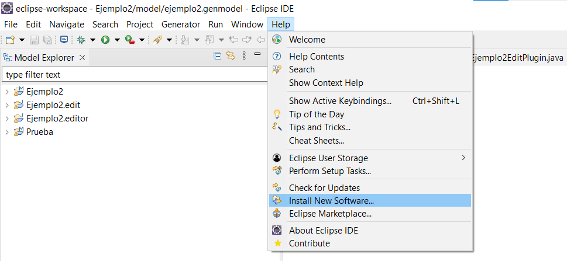
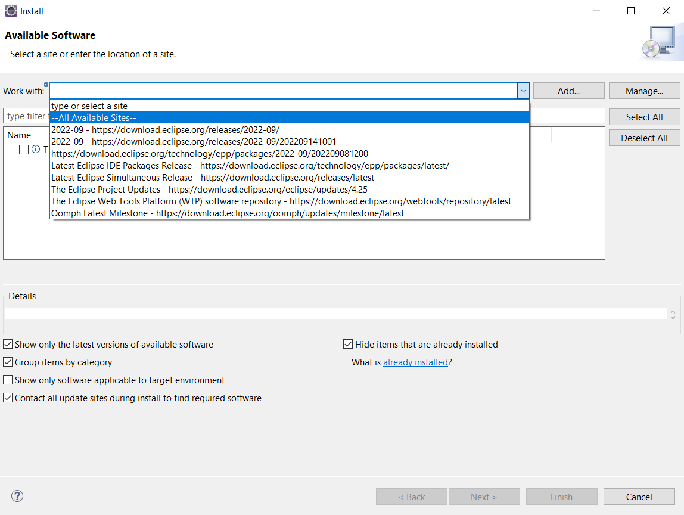
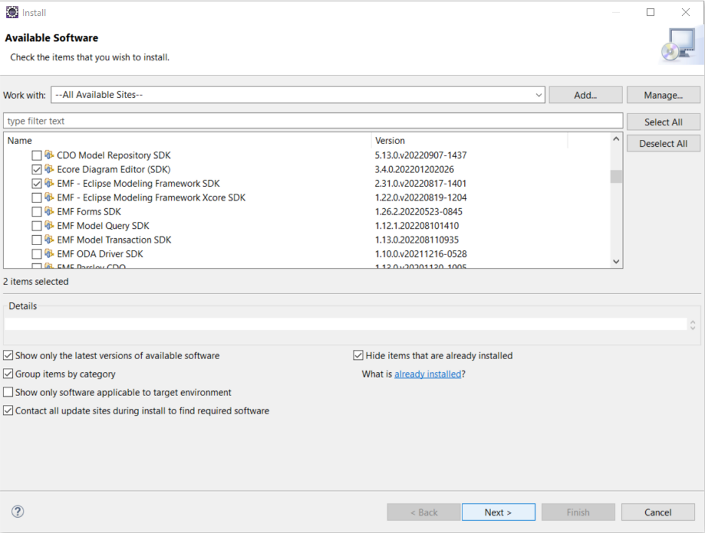
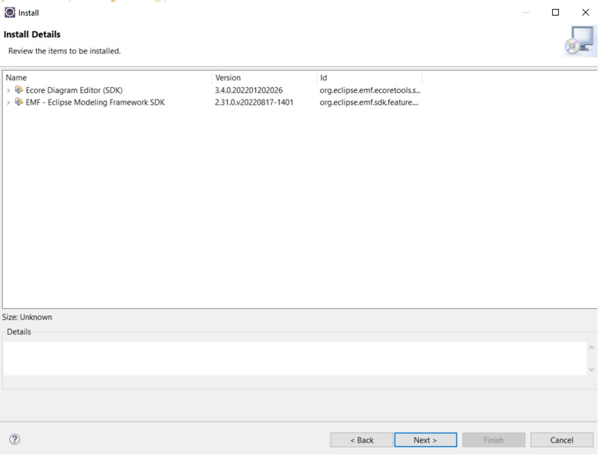
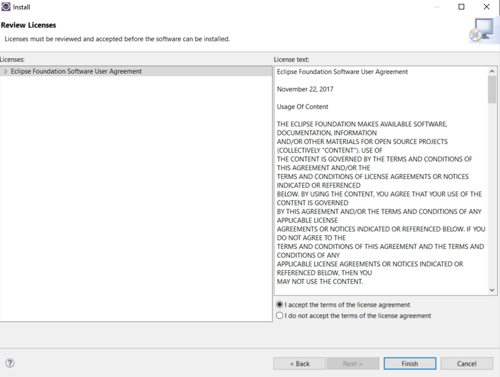

# MANUAL DE INSTALACION DE ECLIPSE MODELING FRAMEWORK

## Instalación

Eclipse Modeling Framework es un framework de modelado y facilidad de generación de código para construir herramientas y otras aplicaciones basadas en un modelo de datos estructurado. Detallaremos los pasos a seguir para realizar la instalacion en el IDE de desarrollo Eclipse:

1. Dentro de Eclipse nos dirigirnos a *Help* y seleccionamos *Install New Software.*...


2. Seleccionamos *--All Available Sities--*...


3. Dentro de la opción Modeling seleccionamos *"Ecore Diagram Editor(SDK)"* y *"EMF - Eclipse Modeling Framework SDK".* Luego clic en *"Next>"*


4. Click en *Next*


5. Aceptamos la licencia y finalizamos.


6. Esperamos que termine el proceso de instalacion que aparece en la barra inferior.


his is a small sample book to give you a feel for how book content is
structured.
It shows off a few of the major file types, as well as some sample content.
It does not go in-depth into any particular topic - check out [the Jupyter Book documentation](https://jupyterbook.org) for more information.

Check out the content pages bundled with this sample book to see more.

```{tableofcontents}
```
