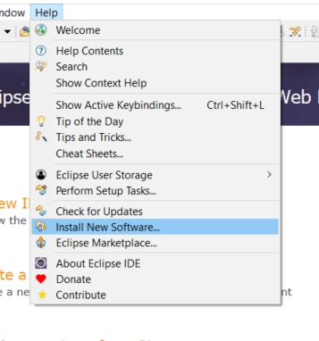

# MANUAL DE INSTALACION DE ECLIPSE MODELING FRAMEWORK

Eclipse Modeling Framework es un framework de modelado y facilidad de generación de código para construir herramientas y otras aplicaciones basadas en un modelo de datos estructurado. Detallaremos los pasos a seguir para realizar la instalacion en el IDE de desarrollo Eclipse:

1. Dentro de Eclipse nos dirigirnos a Help y seleccionamos Install New Software.


2. Seleccionamos --All Available Sities--
{width 80%}

3. Dentro de la opción Modeling seleccionamos "Ecore Diagram Editor(SDK)" y "EMF - Eclipse Modeling Framework SDK"
{width 80%}
4. 

This is a small sample book to give you a feel for how book content is
structured.
It shows off a few of the major file types, as well as some sample content.
It does not go in-depth into any particular topic - check out [the Jupyter Book documentation](https://jupyterbook.org) for more information.

Check out the content pages bundled with this sample book to see more.

```{tableofcontents}
```
